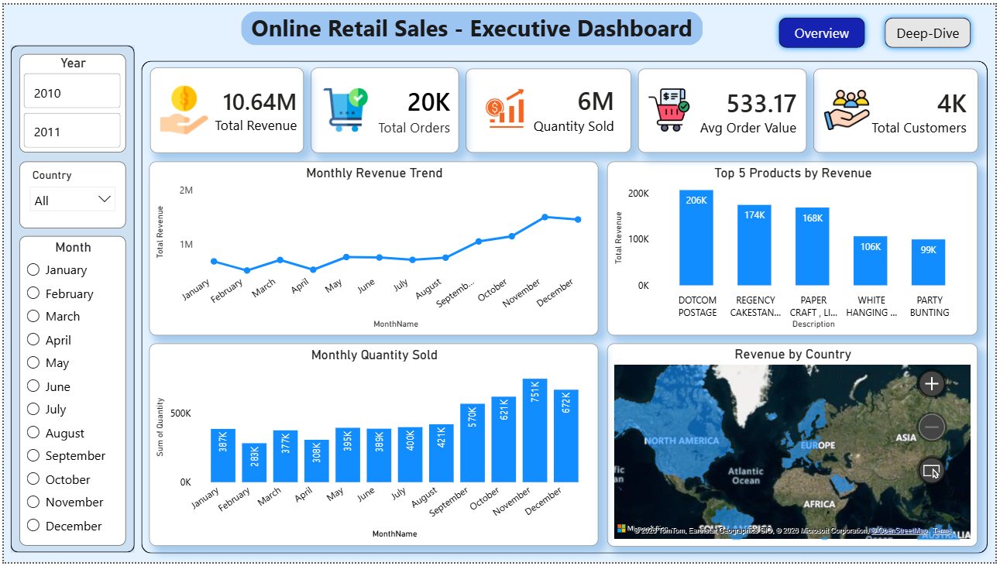
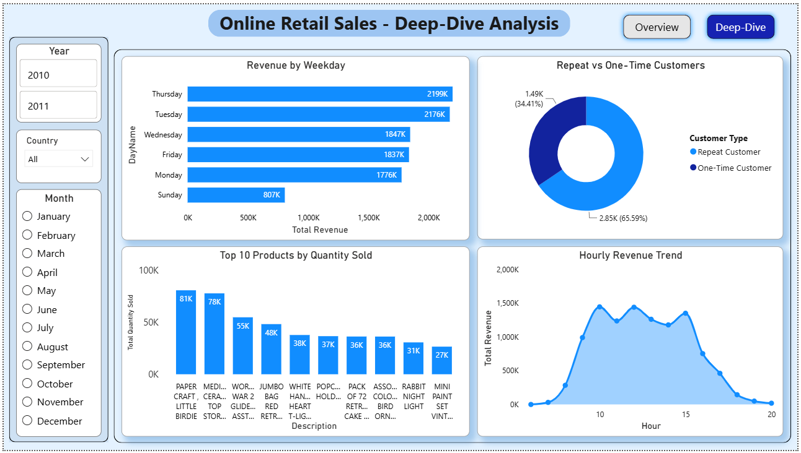

# 🛒 Online Retail Sales Analysis

## 📌 About the Project

This is an end-to-end Data Analytics project based on the Online Retail dataset from Kaggle.

In this project, I first cleaned and analyzed the data using **Python**. After that, I imported the cleaned dataset into **MySQL** and solved different business problems using SQL queries. Finally, I created an interactive dashboard in **Power BI** to visualize the insights.

This project helped me understand the complete workflow of a data analyst, from data cleaning to dashboard creation.

---

## 🛠️ Tools Used

- Python
- Pandas
- NumPy
- Matplotlib
- MySQL
- Power BI
- Jupyter Notebook

---

## 📂 Dataset

- Source: Kaggle – Online Retail Dataset
- Original Records: **541,909**
- Cleaned Records: **524,878**

---

## 📁 Files in this Repository

- `OnlineRetail.zip` – Original dataset
- `online_retail_cleaned.zip` – Cleaned dataset
- `Online_Retail_Sales_Analysis.ipynb` – Python analysis
- `online_retail_sales_analysis.sql` – SQL queries
- `Online_Retail_Sales_Dashboard.pbix` – Power BI dashboard
- `Executive_Dashboard.png` – Executive dashboard
- `Deep_Dive_Dashboard.png` – Deep dive dashboard

---

## 📊 What I Did

### Python

- Cleaned the dataset
- Removed duplicate records
- Removed cancelled transactions
- Created new columns for analysis
- Performed Exploratory Data Analysis (EDA)
- Created charts using Matplotlib
- Generated business insights

### SQL

- Imported the cleaned dataset into MySQL
- Wrote **52 SQL queries**
- Used aggregate functions
- Used GROUP BY, HAVING, ORDER BY
- Used CTEs and Window Functions
- Analyzed customers, products, countries, and sales trends

### Power BI

- Built an Executive Dashboard
- Built a Deep Dive Dashboard
- Added KPI Cards
- Added Slicers for filtering
- Created different visualizations for business analysis

---

## 📈 Key Insights

- Total Revenue: **10.64 Million**
- United Kingdom generated the highest revenue.
- November recorded the highest monthly sales.
- Sales were highest between **10 AM and 3 PM**.
- Thursday generated the highest revenue.
- DOTCOM POSTAGE generated the highest revenue.
- PAPER CRAFT, LITTLE BIRDIE was the highest-selling product by quantity.

---

## 📷 Dashboard Preview

### Executive Dashboard

### Deep Dive Dashboard

---

## 🎯 Conclusion

This project helped me improve my skills in Python, SQL, and Power BI. It also gave me practical experience in data cleaning, data analysis, writing SQL queries, and building interactive dashboards. I learned how to convert raw data into meaningful business insights.

---

## 👨‍💻 Author

**Prem Ranjan**

Aspiring Data Analyst

**Skills:** Python | SQL | Power BI | Excel
